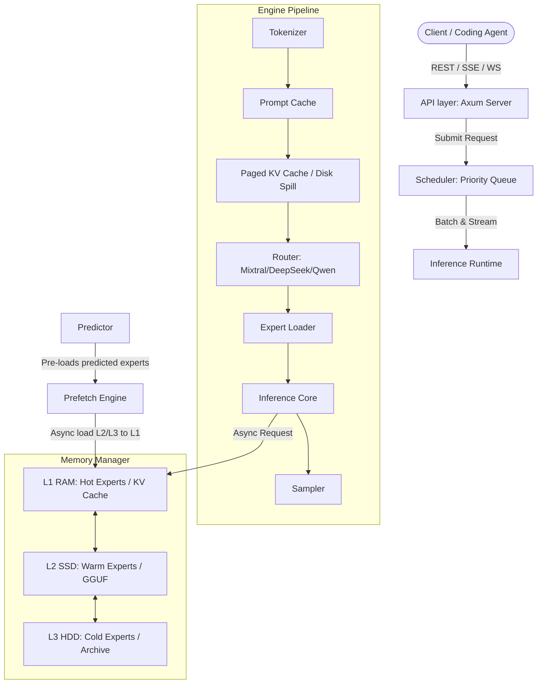

# Garuda: High Performance Rust LLM Runtime with Expert Streaming


Garuda is a plugin-based, high-performance local LLM inference runtime built in Rust. It is designed to run efficiently on CPU and memory-constrained environments (such as Synology NAS, local workstations, or macOS) by leveraging a tiered memory architecture, Expert Streaming, and prefetch prediction for Mixture of Experts (MoE) models.

---

## Architecture Diagram



---

## Core Features

- **OpenAI Compatible API**: Fully compatible with OpenAI REST specifications, including Server-Sent Events (SSE) chat streaming.
- **WebSocket Streaming**: Exposes `/v1/ws` for low-latency bi-directional token streaming and client-side cancellation.
- **Plugin-Based Trait System**: Abstracted core engine traits (`StorageBackend`, `InferenceBackend`) allow hot-swapping computational backends (CPU, CUDA, Vulkan, Metal) without changing the core scheduler or router.
- **Expert Streaming**: Sequentially loads and processes MoE experts one token-step at a time, preventing RAM bandwidth bottlenecks.
- **Tiered Memory Manager**: Automatically tiers model weights across L1 (RAM), L2 (SSD Cache), and L3 (HDD/NAS Archive) utilizing memory mapping (`mmap()`).
- **Expert Prefetch Engine**: Employs a state transition predictor to look ahead and load required experts asynchronously from L2/L3 to L1 RAM before execution.
- **Multi-user Priority Scheduler**: Implements a concurrent scheduler with priority-sorted queuing, batch merging, cancellation propagation, timeouts, and rate limits.

---

## Getting Started

### 1. Configuration (`config.toml`)
Configure the system by creating a configuration file:
```toml
[model]
path = "/models"
context = 32768
gpu = false
threads = 8
expert_cache = "256GB"
prefetch = true
predictor = true
```

### 2. Running the API Server
Start the REST API and WebSocket streaming gateways:
```bash
cargo run --bin garuda -- serve --port 8080 --host 127.0.0.1
```

### 3. Running Microbenchmarks
Evaluate startup times, expert loading latencies, memory cache hits, and token generation throughput:
```bash
cargo run --bin garuda -- benchmark --iterations 100
```

### 4. Running Integration Tests
Validate the tokenizer, MoE execution pipeline, and scheduler:
```bash
cargo test
```

---

## API Endpoints

### 1. Chat Completions (REST & SSE)
- **Endpoint**: `POST /v1/chat/completions`
- **Body**:
```json
{
  "model": "garuda-moe-v1",
  "messages": [
    { "role": "user", "content": "Explain Mixture of Experts." }
  ],
  "stream": true
}
```

### 2. WebSocket Streaming (WS)
- **Endpoint**: `WS /v1/ws`
- **Client payload**:
```json
{
  "prompt": "Explain Mixture of Experts.",
  "priority": "high"
}
```
- **Server response**:
```json
{
  "token": "Explain",
  "error": null,
  "done": false
}
```

### 3. Models List
- **Endpoint**: `GET /v1/models`

### 4. Embeddings
- **Endpoint**: `POST /v1/embeddings`
