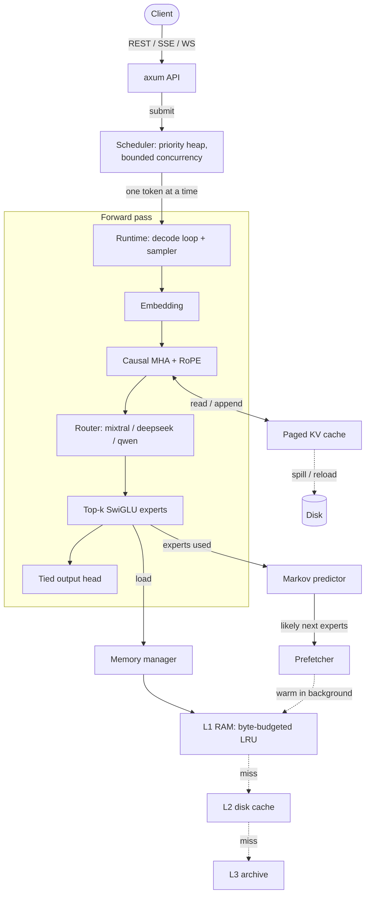

<p align="center">
  
</p>

<h1 align="center">Garuda</h1>

<p align="center">
  A Rust MoE inference runtime with tiered expert storage<br>
  <a href="ABOUT.md">About</a> · <a href="INSTALL.md">Install</a> · <a href="PLUGIN.md">Write a plugin</a>
</p>

Garuda is an inference **engine** for Mixture-of-Experts models: a scheduler, a
tiered expert cache, a paged KV cache, and an OpenAI-compatible API, written in
Rust.

## Read this first

Garuda runs in one of two modes.

**With a real GGUF checkpoint** (`model.gguf` in the config), it loads the weights
and generates real text. Point it at the 1&nbsp;MB TinyStories model and ask for a
story and you get one:

```
$ curl -L https://huggingface.co/ggml-org/models/resolve/main/tinyllamas/stories260K.gguf -o stories260K.gguf
$ curl -s localhost:8080/v1/completions -d '{"prompt":"Once upon a time","max_tokens":60,"temperature":0}'
```
> Once upon a time, there was a little girl named Lily. She loved to play outside
> in the park. One day, she saw a big, red ball. She wanted to play with it, but it
> was too high…

That runs a real Llama-architecture transformer — grouped-query attention with
RoPE, SwiGLU feed-forward, a SentencePiece tokenizer loaded from the file — through
the same runtime, scheduler and API as everything else. Only **F32/F16**
checkpoints load; quantised weights (`Q4_K`, `Q8_0`, …) are rejected, because no
dequantiser exists yet. That is the one real limit on which models work.

**Without a checkpoint**, it runs a synthetic MoE whose weights are pseudo-random
but deterministic. The transformer arithmetic is real; the weights are not, so the
output is meaningless — by construction. This mode exists to exercise the parts
that are the point of the project: the scheduling, the memory tiering, the caching,
the streaming, the cancellation, the load shedding.

| | Status |
|---|---|
| Load & run a real model from GGUF (Llama, F32/F16) | Real, tested |
| SentencePiece tokenizer from GGUF | Real, tested |
| Transformer forward pass (GQA + RoPE + SwiGLU; MoE routing) | Real, tested |
| Tiered expert storage (L1 RAM → L2 disk → L3 archive) | Real, tested |
| Paged KV cache with disk spill (multi-layer, GQA-aware) | Real, tested |
| Scheduler (priority, concurrency limits, cancellation, timeouts, backpressure) | Real, tested |
| OpenAI-compatible API + SSE + WebSocket | Real, tested |
| **Quantised weights (`Q4_K`, `Q8_0`, …)** | **Not implemented** — F32/F16 only |
| **GPU backend** | **Not implemented** (`gpu = true` is a startup error) |
| **Authentication** | **Not implemented** — do not expose this to a network |

The real model runs as a **plugin**: `llama::LlamaBackend` implements the same
`core::InferenceBackend` trait as the synthetic MoE, and `SpmTokenizer` implements
the same `Tokenize` trait as the byte-level one. Selecting a checkpoint swaps both
behind those traits; the scheduler and API never learn which is running.

---

## Architecture



**Expert streaming** means what it says: a token pulls in only the `top_k` experts
it routes to, through the tiered cache — not the whole layer. The predictor learns
a first-order Markov model over which experts actually fire, and the prefetcher
warms its guesses on a background thread while the current token is still
computing. A wrong guess costs one wasted load and can never change the output.

---

## Getting started

```bash
cd garuda

# Run the API server on the synthetic MoE (config.toml is read if present)
cargo run --release -- serve

# Run a real model: set model.gguf in config.toml, or drop the file in and go
curl -L https://huggingface.co/ggml-org/models/resolve/main/tinyllamas/stories260K.gguf -o stories260K.gguf
cargo run --release -- serve   # with model.gguf = "stories260K.gguf"

# Inspect a GGUF file's architecture and tokenizer
cargo run --release -- inspect stories260K.gguf

# Measure startup, expert-load latency, cache behaviour and decode throughput
cargo run --release -- benchmark --iterations 40 --tokens 32

cargo test
```

For prerequisites, installing onto your PATH, running a real model, and
troubleshooting, see [INSTALL.md](INSTALL.md).

Configuration lives in [`garuda/config.toml`](garuda/config.toml). Every key
reaches something; an unknown key is a startup error rather than being silently
ignored.

---

## API

OpenAI-compatible where it counts: `created` is a real timestamp, streams end with
the `data: [DONE]` sentinel SDKs wait for, `usage` is reported, `finish_reason`
says what actually happened, and errors arrive in OpenAI's error envelope with the
status code clients act on — `429` for rate limits, `503` when the queue is full.

| Endpoint | Notes |
|---|---|
| `POST /v1/chat/completions` | `stream: true` for SSE |
| `POST /v1/completions` | |
| `POST /v1/embeddings` | Real pooled hidden states. Untrained, so they carry no meaning — see below |
| `GET /v1/models` | |
| `GET /v1/stats` | Measured scheduler and cache counters |
| `GET /health` | |
| `WS /v1/ws` | Bidirectional streaming with `{"cancel": true}` |

```bash
curl -s localhost:8080/v1/chat/completions \
  -H 'content-type: application/json' \
  -d '{"messages":[{"role":"user","content":"hello"}],"max_tokens":16,"stream":true}'
```

Two extensions beyond the OpenAI shape:

- `X-Garuda-User` identifies the caller for per-user concurrency limits. Absent, everyone
  shares the `anonymous` bucket. **This is not authentication** — anyone can claim any
  name. It is a fairness knob, not a security control.
- `"priority": "low" | "normal" | "high"` on any request.

**About `/v1/embeddings`:** the vectors are the model's real pooled hidden state,
L2-normalised. With a trained checkpoint loaded they mean something; on the
synthetic MoE they are genuine forward passes over untrained weights, so they carry
no semantic structure. Either way the shape and cost are real.

---

## Adding a plugin

A plugin is a Rust type that implements one of these traits. There is no separate
plugin manifest or spec file: **the spec is the trait plus the invariants documented
on it**, which `cargo doc` renders in full. This section summarises the two that
matter; read the doc comments in the source for the authoritative contract.

| Extension point | Trait | Job | Implementations |
|---|---|---|---|
| Compute backend | [`core::InferenceBackend`](garuda/src/core/mod.rs) | context → logits | `moe::MoeEngine`, `llama::LlamaBackend` |
| Tokenizer | [`tokenizer::Tokenize`](garuda/src/tokenizer/mod.rs) | text ↔ tokens | `Tokenizer` (byte), `spm::SpmTokenizer` |
| Storage tier | [`core::StorageBackend`](garuda/src/core/mod.rs) | bytes on some medium | `storage::LocalStorageBackend` |
| Expert source | [`core::ExpertLoader`](garuda/src/core/mod.rs) | id → expert weights | `memory::MemoryManager` |

### The `InferenceBackend` contract

The trait is three methods (`dims`, `hidden`, `logits`), but the load-bearing part
is the invariants an implementation must uphold — the runtime relies on them and
does not re-check:

1. **Consume only unseen positions** — exactly `context[seq.len()..]`. The runtime
   grows `context` by one token per decode step; reprocessing the prefix would make
   decoding O(n²) and double-append to the KV cache.
2. **Advance every KV layer by one position per new token**, so `seq.len()` stays in
   lockstep across layers. Store KV state only in `seq.layer(l)`.
3. **`dims().vocab_size` must equal the tokenizer's `vocab_size()`**, and `logits`
   must return a tensor of that length. `dims()` must pass `ModelDims::validate`.
4. **Error, never panic, on bad input** — out-of-vocab token, exhausted context
   window, empty context.
5. **Determinism** — same context and weights ⇒ same logits. Randomness belongs to
   the sampler; the prompt cache depends on this.

A backend is registered in one place — [`server::Engine::build`](garuda/src/server/mod.rs) —
and the runtime, scheduler and API depend on the traits, not the implementations, so
nothing else changes. The Llama backend was added exactly this way.

For a step-by-step walkthrough with a **complete, runnable example** — a custom
backend built from scratch, satisfying each invariant, wired into the runtime and
registered in `Engine::build` — see **[PLUGIN.md](PLUGIN.md)** and
[`garuda/examples/custom_backend.rs`](garuda/examples/custom_backend.rs)
(`cargo run --example custom_backend`).

### What is still missing

- **Quantised weights.** [`gguf`](garuda/src/gguf/mod.rs) reads F32/F16 tensors and
  the full container; the block-format decoders (`Q4_K`, `Q6_K`, …) that most
  downloadable models use are not written yet. Until they are, only F32/F16
  checkpoints (small models) load.
- **Architectures beyond Llama.** `LlamaBackend` covers the Llama family (dense,
  GQA). Other architectures each need their own `InferenceBackend`.

---

## Licence

Copyright © 2026 HANUMANIT Co., Ltd.

Dual-licensed under either of [Apache License 2.0](LICENSE-APACHE) or the
[MIT license](LICENSE-MIT), at your option. Both require that the copyright
notice be retained; under Apache-2.0 the [NOTICE](NOTICE) file must also be kept
in redistributions and derivative works. Unless you state otherwise, any
contribution you submit is dual-licensed the same way, with no additional terms.
