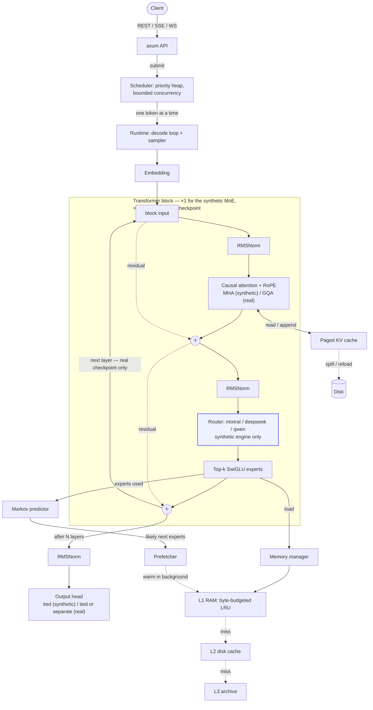

<p align="center">
  
</p>

<h1 align="center">Garuda</h1>

<p align="center">
  A Rust MoE inference runtime with tiered expert storage<br>
  <a href="ABOUT.md">About</a> · <a href="INSTALL.md">Install</a> · <a href="PLUGIN.md">Write a plugin</a>
</p>

Garuda is an inference **engine** for Mixture-of-Experts models: a scheduler, a
tiered expert cache, a paged KV cache, and an OpenAI-compatible API, written in
Rust.

## Read this first

Garuda runs in one of two modes.

**With a real GGUF checkpoint** (`model.gguf` in the config), it loads the weights
and generates real text. Point it at the 1&nbsp;MB TinyStories model and ask for a
story and you get one:

```
$ curl -L https://huggingface.co/ggml-org/models/resolve/main/tinyllamas/stories260K.gguf -o stories260K.gguf
$ curl -s localhost:8080/v1/completions -d '{"prompt":"Once upon a time","max_tokens":60,"temperature":0}'
```
> Once upon a time, there was a little girl named Lily. She loved to play outside
> in the park. One day, she saw a big, red ball. She wanted to play with it, but it
> was too high…

That runs a real Llama-architecture transformer — grouped-query attention with
RoPE, SwiGLU feed-forward, a SentencePiece tokenizer loaded from the file — through
the same runtime, scheduler and API as everything else. The common quant formats all
load — **F32, F16, Q4_0, Q8_0, and every k-quant from `Q2_K` to `Q6_K`** (TinyLlama-1.1B
in Q2_K, Q3_K_M, Q4_K_M and Q5_K_M all answer "the capital of France is" with "Paris").
With `mmap = true` the weights stay packed in a memory-mapped file and are dequantised a
row at a time, so the model uses roughly its on-disk size — about **0.6 GB instead of
4 GB** for that 1.1B Q4_K_M checkpoint — at the cost of slower generation.

**Without a checkpoint**, it runs a synthetic MoE whose weights are pseudo-random
but deterministic. The transformer arithmetic is real; the weights are not, so the
output is meaningless — by construction. This mode exists to exercise the parts
that are the point of the project: the scheduling, the memory tiering, the caching,
the streaming, the cancellation, the load shedding.

| | Status |
|---|---|
| Load & run a real model from GGUF (Llama and Qwen3.5-family; F32/F16/Q4_0/Q8_0/Q2_K–Q6_K) | Real, tested |
| **Qwen3.5-family hybrid architecture** — `qwen35`, which covers **Qwen3.8-27B**, Qwen3.6-27B, Qwen3.5-0.8B…27B | Real, tested — three blocks in four are a **gated delta net** (linear attention with a fixed-size recurrent state) and the fourth is grouped-query attention with a per-head output gate, per-head query/key norms and quarter-width rotation. Verified end to end against a real checkpoint: greedy completion, a chat turn through the checkpoint's own template, and the served API |
| SentencePiece tokenizer from GGUF | Real, tested |
| Byte-level BPE tokenizer from GGUF (`gpt2` vocabularies, as Qwen ships them) | Real, tested — the Qwen pre-tokenizer's split is implemented by hand, with no regex dependency; round-trips English, code, Thai, Chinese and emoji through a real 248 320-entry vocabulary |
| Transformer forward pass — dense **and** mixture-of-experts (top-k routing) | Real, tested |
| Tiered expert storage (L1 RAM → L2 disk → L3 archive) | Real, tested |
| Paged KV cache with disk spill (multi-layer, GQA-aware) | Real, tested — pair spilling with `sliding_window`; under full attention every step reads the whole prefix, so a spilled block is reloaded the moment it is written. Garuda warns at startup when the configuration would do that |
| Scheduler (priority, concurrency limits, cancellation, timeouts, backpressure) | Real, tested |
| Speculative decoding (prompt lookup, no draft model) | Real, measured — on Mixtral (25 GB, 16 GB RAM) a grounded prompt decodes **2.6× faster** (12.5 → 4.8 s/token) and an open-ended one is unaffected (13.2 → 11.6 s/token). Guesses are copied from earlier in the context; greedy output is unchanged token for token, sampled output keeps the caller's distribution. With prompt lookup the speedup is a greedy one — at `temperature = 0.8` acceptance is too low to measure a gain. With a **draft model** (`model.draft_gguf`, vocabulary-checked at startup) it pays at ordinary temperatures too: **1.7–2.0× at `temperature = 0.8`** on Mixtral against a TinyLlama-1.1B draft (9.0 → 4.6–5.3 s/token). Each sequence sizes its own lookahead to what its guesses have been winning |
| Continuous batching — concurrent requests decode in one pass over the weights | Real, tested — ~1.6–1.8× aggregate throughput and about half the median latency at 8 concurrent, measured against one task per request |
| Chunked prefill — a long prompt does not stall the clients already streaming | Real, tested — the worst inter-token gap a streamer sees while a 1474-token prompt is absorbed drops from ~13 s to ~0.2 s. Chunk size is measured from what a decode step actually costs, not fixed |
| OpenAI + Ollama + Anthropic + llama.cpp + TGI APIs, SSE / NDJSON / WebSocket | Real, tested |
| Dequantisation: F32 / F16 / Q4_0 / Q8_0 / Q2_K–Q6_K | Real, tested (runs Q2_K…Q5_K_M models) |
| Memory-mapped packed weights (`mmap = true`), incl. per-expert streaming | Real, tested (~6× less RAM, same output) |
| Batched, expert-grouped prefill | Real, tested — **8× faster prefill on Mixtral-8x7B Q4_K_M (25 GB) on a 16 GB machine**: 386 s → 48 s to first token for a 38-token prompt, because the working set drops from the whole model per token to one layer (7.1 GB → 816 MB). ~2× even on a model that fits in RAM, where the win is decoding each expert's rows once per batch instead of once per token. `model.prefill_batch` tunes or disables it |
| Integer (NEON `i8`) matmul kernel for **every** quantised type | Real, tested — `Q8_0` and all five k-quants dot straight against an int8-quantised activation. Roughly 4–15× faster than dequantise-then-dot depending on type (see below), within quantisation tolerance of it |
| A real MoE checkpoint at scale (Mixtral-8x7B, Q4_K_M, 26 GB) | Real, tested — loads and generates on a 16 GB machine via `mmap`; both GGUF expert-tensor layouts (merged `..._exps` and the older per-expert tensors some conversions use) load correctly |
| Speculative expert prefetch against a real checkpoint | Real, measured — a per-layer Markov predictor warms the likely next experts' mmap pages with `madvise(WILLNEED)` on a background thread. On Mixtral (25 GB, 16 GB RAM) it cuts **time-to-first-token ~1.6×** (61–83 s → 33–51 s, three paired runs). It showed **no measurable effect on decode**: 11.0/12.1/16.6 s per token with it on against 14.5/12.2/10.9 s off — overlapping, no pattern. It helps where the prediction is only a token away, not a whole model pass away |
| Built-in chat page (`GET /`) | Real — talks to `/v1/chat/completions`, same origin, no separate frontend; multiple conversations (sidebar, switch, delete), saved in the browser's `localStorage` (the API key is not: that lives in `sessionStorage`) |
| API key authentication (`Authorization: Bearer` or `x-api-key`) | Real, tested — off by default; set `server.api_keys` to require one. WebSockets may present it as a subprotocol, since browsers cannot set handshake headers |
| **GPU backend** | **Not implemented** (`gpu = true` is a startup error) |

The real model runs as a **plugin**: `llama::LlamaBackend` and `qwen35::Qwen35Backend`
implement the same `core::InferenceBackend` trait as the synthetic MoE, and
`SpmTokenizer` and `BpeTokenizer` implement the same `Tokenize` trait as the byte-level
one. Loading a checkpoint reads its architecture and vocabulary out of the file and
swaps in the pair that matches; the scheduler and API never learn which is running.

---

## Architecture


```mermaid
graph TD
    Client([Client]) -->|REST / SSE / WS| API[axum API]
    API -->|submit| Sched[Scheduler: priority heap,<br/>bounded concurrency]
    Sched -->|one token at a time| RT[Runtime: decode loop + sampler]

    RT --> Embed[Embedding]

    subgraph Block["Transformer block — ×1 for the synthetic MoE,<br/>×N layers for a real checkpoint"]
        direction TB
        In[block input] --> AN[RMSNorm]
        AN --> Attn["Causal attention + RoPE<br/>MHA (synthetic) / GQA (real)"]
        Attn --> AR(("＋"))
        In -.->|residual| AR
        AR --> FN[RMSNorm]
        FN --> Router["Router: mixtral / deepseek / qwen<br/>synthetic engine only"]:::synthOnly
        Router --> Experts[Top-k SwiGLU experts]
        Experts --> FR(("＋"))
        AR -.->|residual| FR
    end

    Embed --> In
    FR -->|next layer — real checkpoint only| In
    FR -->|after N layers| ONorm[RMSNorm]
    ONorm --> Logits["Output head<br/>tied (synthetic) / tied or separate (real)"]

    Attn <-->|read / append| KV[Paged KV cache]
    KV -.->|spill / reload| Disk[(Disk)]

    Experts -->|load| MM[Memory manager]
    MM --> L1[L1 RAM: byte-budgeted LRU]
    L1 -.->|miss| L2[L2 disk cache]
    L2 -.->|miss| L3[L3 archive]

    Experts -->|experts used| Pred[Markov predictor]
    Pred -->|likely next experts| Pre[Prefetcher]
    Pre -.->|warm in background| L1

    classDef synthOnly fill:#eef2ff,stroke:#6366f1,stroke-width:2px;
```

The shaded node runs only on the synthetic engine — a real checkpoint never touches
`router::Router` and ignores the config's `router`/`experts`/`top_k` keys entirely,
using a fixed Mixtral-style gate instead (see [Read this first](#read-this-first)).
Likewise, GQA and the ×N layer loop are real-checkpoint-only: the synthetic engine
is a single block with plain multi-head attention.

The diagram draws the Llama-family block. A Qwen3.5-family checkpoint keeps the same
outline — norm, token mixer, residual, norm, feed-forward, residual — but three blocks
in four replace the attention node with a gated delta net, which reads and writes a
fixed-size recurrent state instead of the KV cache; only the fourth block touches the
cache at all. See [A hybrid checkpoint](#a-hybrid-checkpoint--qwen38-27b).

**Expert streaming** means what it says: a token pulls in only the `top_k` experts
it routes to, through the tiered cache — not the whole layer. The predictor learns
a first-order Markov model over which experts actually fire, and the prefetcher
warms its guesses on a background thread while the current token is still
computing. A wrong guess costs one wasted load and can never change the output.

The same predictor/prefetcher pair also runs against a real mmapped checkpoint —
there is no L1/L2/L3 tier there, so instead of warming an expert into the tiered
cache, it touches that expert's mmap pages directly on a background thread. The
page fault the forward pass would otherwise pay synchronously happens ahead of
time instead; each of a real model's 32 layers routes independently, so the
routing history and predictions are tracked per layer, not globally.

---

## Getting started

```bash
cd garuda

# Run the API server on the synthetic MoE (config.toml is read if present)
cargo run --release -- serve
# Open http://localhost:8080/ for a built-in chat page — same origin, no
# separate frontend, talks to the same /v1/chat/completions any client uses.

# Run a real model: set model.gguf in config.toml, or drop the file in and go
curl -L https://huggingface.co/ggml-org/models/resolve/main/tinyllamas/stories260K.gguf -o stories260K.gguf
cargo run --release -- serve   # with model.gguf = "stories260K.gguf"

# Inspect a GGUF file's architecture and tokenizer
cargo run --release -- inspect stories260K.gguf

# Measure startup, expert-load latency, cache behaviour and decode throughput
cargo run --release -- benchmark --iterations 40 --tokens 32

cargo test
```

### A checkpoint larger than RAM — Mixtral-8x7B

[`garuda/mixtral.toml`](garuda/mixtral.toml) is a worked config for Mixtral-8x7B
Instruct Q4_K_M (~26 GB) on a 16 GB machine — the setup the Mixtral figures above
were measured on. It sets `mmap = true` so the weights stay packed on disk,
`prefill_batch = 256`, a 2048-token window, one sequence at a time, and a
900-second request timeout, because here a token costs seconds rather than
milliseconds.

```bash
cd garuda

# ~26 GB
curl -L https://huggingface.co/TheBloke/Mixtral-8x7B-Instruct-v0.1-GGUF/resolve/main/mixtral-8x7b-instruct-v0.1.Q4_K_M.gguf \
  -o mixtral-8x7b-instruct-v0.1.Q4_K_M.gguf

# Check what you downloaded — architecture, expert count, and whether it loads
cargo run --release -- inspect mixtral-8x7b-instruct-v0.1.Q4_K_M.gguf

# Edit mixtral.toml: model.gguf ships as a "/path/to/…" placeholder
cargo run --release -- --config mixtral.toml serve
```

`--config` is a top-level flag, so it goes **before** the subcommand —
`garuda --config mixtral.toml serve`, not `garuda serve --config mixtral.toml`,
which is a usage error. That config binds port **8090**, not 8080:

```bash
curl -s localhost:8090/v1/chat/completions \
  -H 'content-type: application/json' \
  -d '{"messages":[{"role":"user","content":"Name three prime numbers."}],"max_tokens":32}'
```

The built-in chat page is there too, at `http://localhost:8090/`.

Expect the first token in **33–51 s** and **~5–12 s per token** after it — the
figures in the table above, on a 16 GB machine. Every generated token is another
pass over 26 GB of memory-mapped weights, so length is what costs time:
`sampling.max_tokens` is pinned to 48 in that config, and the benchmark wants a
handful of iterations rather than the forty a small model tolerates.

```bash
cargo run --release -- --config mixtral.toml benchmark --iterations 3 --tokens 8
```

That config speculates by prompt lookup, which pays on grounded prompts at
`temperature = 0` and not at the `0.7` it samples at. To speculate at that
temperature, point it at a small draft checkpoint whose vocabulary matches — a
TinyLlama-1.1B was worth 1.7–2.0× — and the size is checked against the main
model's at startup rather than assumed:

```toml
[model]
draft_gguf = "/path/to/tinyllama-1.1b-chat-v1.0.Q4_K_M.gguf"
```

### A hybrid checkpoint — Qwen3.8-27B

[`garuda/qwen3.8.toml`](garuda/qwen3.8.toml) runs `Qwen3.8-27B` in Q4_K_M (~19 GB)
from a memory-mapped file. It is a different shape of model from Mixtral, and the
config reflects that: no experts to stream, but three quarters of its 64 blocks are
**gated delta nets** — linear attention that folds the sequence into a fixed-size
recurrent state instead of a growing cache of keys and values.

```bash
cd garuda

# ~19 GB. The BF16 and Q8_0 quantisations in the same repository also load.
curl -L https://huggingface.co/ggml-org/Qwen3.8-27B-GGUF/resolve/main/Qwen3.8-27B-Q4_K_M.gguf \
  -o Qwen3.8-27B-Q4_K_M.gguf

# Reports the hybrid split, and whether the file bundles prediction blocks
cargo run --release -- inspect Qwen3.8-27B-Q4_K_M.gguf

# Edit qwen3.8.toml: model.gguf ships as a "/path/to/…" placeholder
cargo run --release -- --config qwen3.8.toml serve   # port 8091
```

What that buys, and what it costs:

- **The KV cache is a quarter the size** of an all-attention model of the same
  shape. Only the 16 attention blocks store keys and values; the 48 recurrent
  blocks store nothing per position. They still *count* positions, because the
  runtime requires every layer of a sequence to advance together.
- **A sequence carries ~144 MB of recurrent state** regardless of its length — the
  same at ten tokens as at a hundred thousand. That is charged to the prompt cache's
  byte budget, so `memory.prompt_cache` has to exceed it before a prompt can be
  cached at all; Garuda warns at startup when it does not.
- **Speculative decoding is off** for this architecture, and says so rather than
  guessing wrong. Verifying guesses means being able to discard the rejected ones,
  and a recurrent state that summarises every token it has read cannot be rewound.
  `model.draft_gguf` is a startup error here, not a silently ignored key.
- **Vision is not supported.** Qwen3.8-27B is a vision-language model; its image
  tower ships as a separate `mmproj-*.gguf` and there is no image input path here.
  The text half is complete.

On a 16 GB machine a forward pass over this checkpoint takes **~24 s** — every token
is another pass over 19 GB of memory-mapped weights, and unlike Mixtral there are no
experts to skip: a dense 27B touches all of it. Budget accordingly, and use

```bash
cargo run --release --example qwen35_probe -- Qwen3.8-27B-Q4_K_M.gguf "The capital of France is"
```

to ask a question a single pass answers — the most likely next tokens, with their
scores — rather than waiting on a dozen decode steps to find out.

Its chat template opens a `<think>` block for the assistant. Garuda closes it
immediately by default — `enable_thinking = false` in the template's own terms — so a
reply is the answer and nothing else:

```bash
curl -s localhost:8091/v1/chat/completions \
  -H 'content-type: application/json' \
  -d '{"messages":[{"role":"user","content":"What is the capital of Thailand?"}],"max_tokens":40}'
```

Set `model.thinking = true` to leave the block open, which is what the checkpoint does
by default. The reasoning then arrives as ordinary content ahead of the answer, so
raise `sampling.max_tokens` to cover both.

The same architecture at a size that fits comfortably in RAM is the quickest way to
see it work — `Qwen3.5-0.8B` is 24 blocks of the identical arithmetic:

```bash
curl -L https://huggingface.co/ggml-org/Qwen3.5-0.8B-GGUF/resolve/main/Qwen3.5-0.8B-Q8_0.gguf \
  -o Qwen3.5-0.8B-Q8_0.gguf
```

That checkpoint is also what the repository's own real-weights tests run against:

```bash
GARUDA_QWEN35_GGUF=Qwen3.5-0.8B-Q8_0.gguf \
  cargo test --release --test qwen35_real -- --nocapture
```

Without that variable those tests skip, so `cargo test` stays runnable on a machine
with no checkpoint on it.

For prerequisites, installing onto your PATH, running a real model, and
troubleshooting, see [INSTALL.md](INSTALL.md).

Configuration lives in [`garuda/config.toml`](garuda/config.toml), read from the
working directory when no `--config` is given; [`garuda/mixtral.toml`](garuda/mixtral.toml)
is a second, self-contained example of the same keys. Every key reaches something;
an unknown key is a startup error rather than being silently ignored.

---

## API

Garuda speaks five wire formats over the same engine, so most existing clients work
unchanged: **OpenAI**, **Ollama**, **Anthropic**, **llama.cpp**, and **TGI**. The
scheduler and runtime don't know which protocol asked — each adapter (`api`, `ollama`,
`anthropic`, `llamacpp`, `tgi`) is a thin translation layer over one shared engine core
(`session`: render the prompt, submit it, drive the result to a full reply or a stream
of decoded pieces). Adding a protocol means parsing its request and formatting its
reply; the engine-facing middle is written once.

Every chat-shaped adapter renders turns through the **checkpoint's own chat template**,
read from its `tokenizer.chat_template` metadata — `<|user|>…</s>` for TinyLlama and
Zephyr, `[INST]…[/INST]` for Mistral and Mixtral, plus ChatML and Llama 3. This is not
cosmetic. An instruction-tuned model handed a generic `user: …` transcript reverts to
being the document completer it started as: it answers, then writes the user's next turn
and keeps going until `max_tokens` cuts it off. Nothing errors, the prose is fluent, and
the reply is wrong. A checkpoint that names no template gets the plain transcript and
says so at startup.

Turn markers are placed as token ids around content that is encoded separately, so a
message containing `</s>` or `<|im_end|>` is text — a user cannot close their own turn
and open another, putting words in the conversation as though the server had.

**OpenAI** — `created` is a real timestamp, streams end with the `data: [DONE]`
sentinel SDKs wait for, `usage` is reported, `finish_reason` is honest, and errors use
OpenAI's envelope with the status code clients act on (`429` rate limit, `503` busy).

| Endpoint | Notes |
|---|---|
| `POST /v1/chat/completions` | `stream: true` for SSE |
| `POST /v1/completions` | |
| `POST /v1/embeddings` | Real pooled hidden states, up to 256 inputs per request. Untrained, so they carry no meaning — see below |
| `GET /v1/models` · `GET /v1/stats` · `GET /health` | Models list, measured counters, health |
| `WS /v1/ws` | Bidirectional streaming with `{"cancel": true}` |

**Ollama** — NDJSON streaming (not SSE), params under `options`.

| Endpoint | Notes |
|---|---|
| `POST /api/generate` | `{"prompt": …, "options": {"num_predict": …}}` |
| `POST /api/chat` | `{"messages": […]}` |
| `GET /api/tags` · `GET /api/version` | Model list, version |

**Anthropic** — content blocks and the typed SSE stream (`message_start` →
`content_block_delta` → `message_stop`).

| Endpoint | Notes |
|---|---|
| `POST /v1/messages` | `stream: true` for the Anthropic event stream |

**llama.cpp** — the `llama-server` shape: `n_predict`, a single `{"content": …}` object,
and SSE `{"content": …, "stop": false}` frames ending in a `"stop": true` frame with
`tokens_predicted` / `tokens_evaluated`.

| Endpoint | Notes |
|---|---|
| `POST /completion` | `{"prompt": …, "n_predict": …}`, `stream: true` for SSE |

**TGI** — Hugging Face Text Generation Inference: `{"inputs": …, "parameters": {…}}`,
with `generated_text` on `/generate` and per-token SSE events on `/generate_stream`
(the terminal event carries `generated_text` and `details.finish_reason`).

| Endpoint | Notes |
|---|---|
| `POST /generate` | `parameters.details: true` adds `finish_reason` / `generated_tokens` |
| `POST /generate_stream` | Per-token SSE `token` events |

```bash
curl -s localhost:8080/v1/chat/completions \
  -H 'content-type: application/json' \
  -d '{"messages":[{"role":"user","content":"hello"}],"max_tokens":16,"stream":true}'
```

Two extensions beyond the OpenAI shape:

- `X-Garuda-User` identifies the caller for per-user concurrency limits, on **every**
  protocol above — OpenAI, Ollama, Anthropic, llama.cpp, TGI and the WebSocket.
  Absent, everyone shares the `anonymous` bucket. **This is not authentication** —
  anyone can claim any name. It is a fairness knob, not a security control. Real
  authentication is `server.api_keys` (below), a separate, independent mechanism.
- `"priority": "low" | "normal" | "high"` on any request (OpenAI routes).

**Authentication** — off by default. Set `server.api_keys` to one or more shared
secrets and every request except `GET /health` and `GET /` needs one, sent as
`Authorization: Bearer <key>` (OpenAI, llama.cpp, Ollama clients) or `x-api-key: <key>`
(Anthropic clients) — whichever a client sends is checked, so nothing downstream needs
to know or care which scheme was used. Keys are compared in constant time. The
built-in chat page has an API key field under Settings, held in the browser's
`sessionStorage` — the tab, not the disk, so a credential does not outlive the session
the way the saved conversations do.

The browser `WebSocket` constructor cannot set request headers, so `/v1/ws` also
accepts the key as a subprotocol — `new WebSocket(url, ['garuda.api-key.' + key])`,
the same convention the Kubernetes API server uses. A query parameter would be
simpler and worse: URLs land in access logs, and this server logs every request URI.

**About `/v1/embeddings`:** the vectors are the model's real pooled hidden state,
L2-normalised. With a trained checkpoint loaded they mean something; on the
synthetic MoE they are genuine forward passes over untrained weights, so they carry
no semantic structure. Either way the shape and cost are real.

---

## Adding a plugin

A plugin is a Rust type that implements one of these traits. There is no separate
plugin manifest or spec file: **the spec is the trait plus the invariants documented
on it**, which `cargo doc` renders in full. This section summarises the two that
matter; read the doc comments in the source for the authoritative contract.

| Extension point | Trait | Job | Implementations |
|---|---|---|---|
| Compute backend | [`core::InferenceBackend`](garuda/src/core/mod.rs) | context → logits | `moe::MoeEngine`, `llama::LlamaBackend`, `qwen35::Qwen35Backend` |
| Tokenizer | [`tokenizer::Tokenize`](garuda/src/tokenizer/mod.rs) | text ↔ tokens | `Tokenizer` (byte), `spm::SpmTokenizer`, `bpe::BpeTokenizer` |
| Storage tier | [`core::StorageBackend`](garuda/src/core/mod.rs) | bytes on some medium | `storage::LocalStorageBackend` |
| Expert source | [`core::ExpertLoader`](garuda/src/core/mod.rs) | id → expert weights | `memory::MemoryManager`, `prefetch::GgufPagePrefetcher` |

### The `InferenceBackend` contract

The trait is three required methods (`dims`, `hidden`, `logits`) plus one defaulted
(`logits_batch`, which runs several independent sequences and by default just calls
`logits` for each — override it only if your backend can share work across them). The
load-bearing part
is the invariants an implementation must uphold — the runtime relies on them and
does not re-check:

1. **Consume only unseen positions** — exactly `context[seq.len()..]`. The runtime
   grows `context` by one token per decode step; reprocessing the prefix would make
   decoding O(n²) and double-append to the KV cache.
2. **Advance every layer by one position per new token**, so `seq.len()` stays in
   lockstep across layers. Store per-position state only in `seq.layer(l)`. A layer
   that stores nothing still counts positions — a hybrid model's recurrent layers
   append to a zero-width cache and keep their fixed-size state in `seq.linear(l, …)`.
3. **`dims().vocab_size` must equal the tokenizer's `vocab_size()`**, and `logits`
   must return a tensor of that length. `dims()` must pass `ModelDims::validate`.
4. **Error, never panic, on bad input** — out-of-vocab token, exhausted context
   window, empty context.
5. **Determinism** — same context and weights ⇒ same logits. Randomness belongs to
   the sampler; the prompt cache depends on this.

A backend is registered in one place — [`server::Engine::build`](garuda/src/server/mod.rs) —
and the runtime, scheduler and API depend on the traits, not the implementations, so
nothing else changes. The Llama backend was added exactly this way, and the Qwen3.5
one after it: `Engine::build` reads the architecture out of the file and picks the
backend and tokenizer that match.

For a step-by-step walkthrough with a **complete, runnable example** — a custom
backend built from scratch, satisfying each invariant, wired into the runtime and
registered in `Engine::build` — see **[PLUGIN.md](PLUGIN.md)** and
[`garuda/examples/custom_backend.rs`](garuda/examples/custom_backend.rs)
(`cargo run --example custom_backend`).

### What is still missing

- **The remaining quant formats.** Every type that decodes today has an integer
  kernel. What is missing is decoders: the `*_1` linear quants (`Q4_1`, `Q5_1`) and the
  IQ imatrix quants have none, so those checkpoints are refused rather than run.
- **Architectures beyond Llama and Qwen3.5.** `LlamaBackend` covers the Llama family
  (dense and MoE, GQA) and `Qwen35Backend` the dense Qwen3.5 hybrids. The
  mixture-of-experts sibling `qwen35moe` (Qwen3.5/3.6-35B-A3B) is refused by name
  rather than half-run, and every other architecture needs its own
  `InferenceBackend`.
- **Anything but text on a Qwen3.5 checkpoint.** These are vision-language models, and
  the image tower ships as a separate `mmproj` file this runtime has no input path
  for; their multi-token-prediction block ships separately too (or bundled and unused).
  Text in, text out is what runs.
- **A draft model chosen for the target automatically.** `model.draft_gguf` has to be
  pointed at a vocabulary-compatible checkpoint by hand, and getting it wrong is a
  startup error rather than something the runtime can resolve.
- **A draft model.** Prompt lookup only fires where the output echoes the input. A
  small draft checkpoint sharing the vocabulary would speculate on open-ended text
  too, at the cost of a second model to load and keep resident.

---

## Licence

Copyright © 2026 HANUMANIT Co., Ltd.

Dual-licensed under either of [Apache License 2.0](LICENSE-APACHE) or the
[MIT license](LICENSE-MIT), at your option. Both require that the copyright
notice be retained; under Apache-2.0 the [NOTICE](NOTICE) file must also be kept
in redistributions and derivative works. Unless you state otherwise, any
contribution you submit is dual-licensed the same way, with no additional terms.
